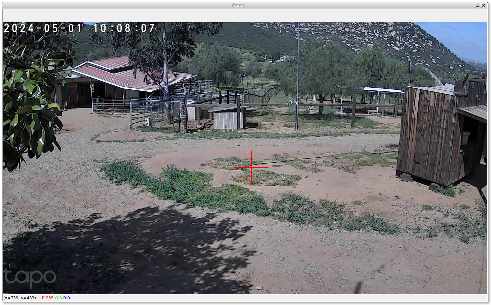

# Camera

Simple app to view and control Tapo500 Video Camera.

Something got broke with Python 3.12 - revert to older version - need to investigae further:

      bash
      cd ~/miniconda3/envs/
      conda create -y --prefix "py3_10" -c conda-forge "python==3.10.*" "tk[build=xft_*]"
      exit

      cd ~/Python/camera
      conda activate py3_10
      pip3 install -r requirements.txt
      
